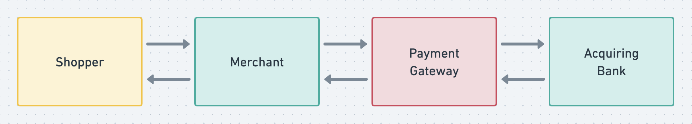

# Payment Gateway

## Introduction

It is a conceptual system for executing payments against a bank institution on behalf of merchants.

On a high level, the context where it fits is it the one where a **Shopper** attempts to purchase items from a **Merchant**. The **Merchant** uses the **Payment Gateway** as a way to request and attest the payment was succesful against an **Acquiring Bank**, possibly moving forward with its checkout's intricacies afterwards. This process is depicted in the image below.



One aspect that is taken into consideration is that a verification step happens between the **Acquiring Bank** and the **Shopper**. It usually happens through email, SMS, or a push notification into a mobile app installed in a previously verified device. Therefore, the flow considered is shown below.


## Architecture

A choice in favor of consistency is made along all the aspects described below. The ultimate goal is to assure that money will only flow out of a **Shopper**'s bank account or credit card if and only if the **Payment Gateway** succeeds in executing all the necessary steps it is responsible for.

### Exposure

The **Payment Gateway** is envisioned as an API acessible to two different networks:

- **public internet**: the medium through which merchants can connect to it.
- **bank vpn**: a safe and secure connection with the **Acquiring Bank**.

### High level API

It provides 4 endpoints:

- `GET /login HTTP/1.1`:
  - used by a **Merchant**'s system to authenticated itself;
  - returns a JWT is successful;
  - acessible to the **public internet**.
- `POST /payment HTTP/1.1`:
  - used by a **Merchant**'s system to request a payment;
  - returns the payment id if the request was successful;
  - it will not inform whether the payment itself was successful or not just yet;
  - acessible to the **public internet**.
- `GET /payment/{id} HTTP/1.1` used by a **Merchant**'s system to request the status of a payment (acessible to the **public internet**).
- `PUT /payment HTTP/1.1`:
  - used by the **Acquiring Bank** to inform whether a payment was successful or not after its verification with the **Shopper**;
  - if the **Acquiring Bank** doesn't receive a successful response for this request, it should retry, suspend, or cancel the operation on its end;
  - acessible to the **bank vpn**.

There two very important decisions taken here:

- The **Merchant** is responsible for keeping track of payment ids.
  - In the future the API can be extended to allow a **Merchant** to query their payment requests in a more flexible way, but it is put aside for now in order to focus on the more importat aspects of the **Payment Gateway**.
  - By returning a payment id immediatly after the payment request without informing the final status is important to create decoupling among the components described below. It would be very costly and risky to keep a connection alive with the **Merchant** during all the payment process.
- The **Acquiring Bank** is responsible for explicitly connecting back to the **Payment Gateway** and informing the fate of a payment request.
  - Perhaps it is not how things are done in actual systems, but this decision assures consistency due to its robustness against the following error scenarios:
    - Scenario 1:
      - step 1: the **Payment Gateway** requests a payment;
      - step 2: the **Acquiring Bank** starts the verification process;
      - step 3: some outage on the **Payment Gateway**'s side causes it to go offline;
      - Consequence: the **Acquiring Bank** can suspend the payment (or not), but now the **Payment Gateway** needs to have a more complex procedure to account for these kind of errors.
    - Scenario 2:
    - - step 1: the **Payment Gateway** requests a payment;
      - step 2: the **Acquiring Bank** starts the verification process;
      - step 3: the **Acquiring Bank** informs the payment was successful;
      - step 4: some outage on the **Payment Gateway**'s happens and it fails to persist the success;
      - Consequence: reconciliation becomes necessary between what the **Payment Gateway** and the **Acquiring Bank**.
  - Real Banks might not accept this burden, but this decision is taken here in order to demonstrate a possible robust and consistent solution.

### Payment Gateway Components

The **Payment Gateway** is composed of 4 services:

- **Payment API** is a stateless component responsible for executing the business logic only. It can be scalled independently to accommodate sudden spikes on workload or periods of low usage.
- **Merchant Service** is responsible for storing all the information related to **Merchants**. It is used for authentication, authorization, and resource utilization quota.
- **Rate Limiter** is used by the API to enforce fair resource utilization by **Merchants**. It makes use ot the **Merchant Service** to discover usage quotas which can perhaps differ for different **Merchants** depending on their subscription level.
- **Ledger Service** controls access to an ACID complient database.


In order to keep the focus on the important components, logging will be written directly to STDOUT. In a real application it would be important to have more thorough collection of logging, metrics, and tracing.

### Payment flow

At a high level, the golden path imagined for a payment request is the following:


Some variation could be:


There are many bad weather scenarios. The most important one relies on the expectation that the **Acquiring Bank** will suspend a payment if it doesn't receive a successful acknowledgement from the **Payment Gateway** (meaning there is no guarantee that the Ledger Service was updated successfully).

## Code organization

The 4 services that compose the **Payment Gateway** could have their individuals repositories and be maintained by different teams responsible for their development, testing, deployment, and monitoring. Here each one is stored in a corresponding sub directory.

- **Payment API**: `/api`
- **Ledger Service**: `/ledger`
- **Merchant Service** `/merchant`
- **Rate Limiter**: `/ratelimiter`

There is a 5th directory with a **Acquiring Bank** simulator. It is very simple, serving only as a way to test and demonstrate the operation of the rest of the system.

- **Acquiring Bank**: `/bank`

Finally, there is test data (`/data`) and a simple UI (`/ui`), where it is possible to manually submit payment requests on behalf of a fictional **Merchant** and observe the system functioning.

## Testing

There are directives for testing individual components in their folders:

- [Merchant Service](merchant/README.md)
- [Rate Limiter Service](ratelimiter/README.md)
- [Ledger Service](ledger/README.md)
- [Bank Simulator](bank/README.md)
- [Payment API](api/README.md)
- [Merchant UI](merchant-ui/README.md)


### Local testing

For testing locally, there is a script called `local_test.sh` in the root folder. It will build and run all services. The Merchat UI will be acessible at `http://localhost:3000/`.

```bash
$ chmod +x local_test.sh && ./local_test.sh
```

### Docker Compose testing

There is a Docker Compose for launching the whole system as well (`docker-compose.yaml`).

```bash
$ docker-compose up
```

### Prerequisites

Before using this application, please ensure that you have Docker and Docker Compose installed on your system. Follow the instructions below to install them:

#### Docker

1. Visit the Docker website: https://www.docker.com
2. Select the appropriate Docker edition for your operating system (e.g., Docker Desktop for Windows/Mac, Docker Engine for Linux).
3. Download the installer and follow the installation instructions provided for your specific operating system.
4. After installation, verify that Docker is running by opening a terminal/command prompt and executing the following command:

```bash
$ docker version
```

You should see version information for both the Docker Engine and Docker Client.

#### Docker Compose

Docker Compose is typically bundled with Docker Desktop for Windows and Mac, so if you've installed Docker Desktop, you should already have Docker Compose. For Linux users or other cases where Docker Compose is not included, follow these steps:

1. Visit the Docker Compose GitHub repository: https://github.com/docker/compose
2. In the repository's releases section, locate the latest release suitable for your operating system.
3. Copy the URL of the binary for the relevant release.
4. Open a terminal/command prompt and execute the following command, replacing <URL> with the URL you copied:

```bash
$ sudo curl -L "<URL>" -o /usr/local/bin/docker-compose
```

5. Make the Docker Compose binary executable by running:

```bash
$ sudo chmod +x /usr/local/bin/docker-compose
```

6. Verify the installation by executing:

```bash
$ docker-compose version
```

You should see version information for Docker Compose.