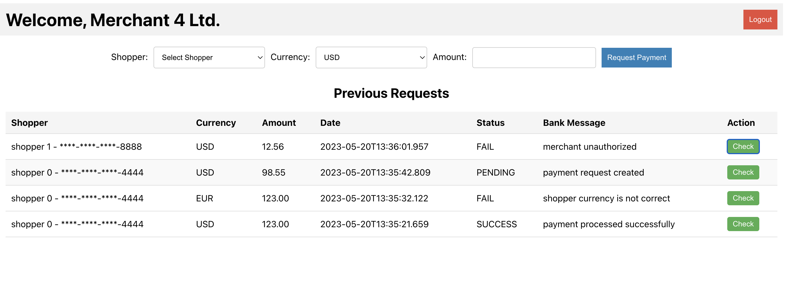

# Merchant UI

It is a React App to play with requests created by **Merchants**. It is intended to be a sandbox for creating payments and checking their statuses.

It has some hard coded shoppers and it is useful to test the **Payment Gateway** from the perspective of a **Merchant**.

The App is very naïve, the code is quite messy, and there is no unit testing yet.

## Overview

Login Page:


Dashboard:



## Hard coded **Shoppers**

```json
[
    {
        "id": 0,
        "name": "shopper 0",
        "card": {
            "number": "1111-2222-3333-4444",
            "name": "shopper 0",
            "expire_month": 10,
            "expire_year": 2050,
            "cvv": 123
        },
        "display": "shopper 0 - ****-****-****-4444"
    },
    {
        "id": 1,
        "name": "shopper 1",
        "card": {
            "number": "5555-6666-7777-8888",
            "name": "shopper 1",
            "expire_month": 10,
            "expire_year": 2040,
            "cvv": 456
        },
        "display": "shopper 1 - ****-****-****-8888"
    },
    {
        "id": 2,
        "name": "shopper 2",
        "card": {
            "number": "9999-1010-1111-1212",
            "name": "shopper 2",
            "expire_month": 3,
            "expire_year": 2045,
            "cvv": 789
        },
        "display": "shopper 2 - ****-****-****-1212"
    },
    {
        "id": 4,
        "name": "shopper 4",
        "card": {
            "number": "1313-1414-1515-1616",
            "name": "shopper 5",
            "expire_month": 1,
            "expire_year": 2070,
            "cvv": 987
        },
        "display": "shopper 4 - ****-****-****-1616"
    },
    {
        "id": 5,
        "name": "shopper 5",
        "card": {
            "number": "1717-1818-1919-2020",
            "name": "shopper 5",
            "expire_month": 1,
            "expire_year": 2070,
            "cvv": 987
        },
        "display": "shopper 5 - ****-****-****-2020"
    }
]
```

## **Acquiring Bank** configuration

It will determine if a **Shopper** matches a given card, if they authorized a given **Merchant**, if it has enough balance, if the currency is correct, and so on.

```json
[
    {
        "name": "shopper 0",
        "description": "shopper with valid card and large balance in USD",
        "card": {
            "number": "1111-2222-3333-4444",
            "name": "shopper 0",
            "expire_month": 10,
            "expire_year": 2050,
            "cvv": 123
        },
        "auto_approve": [
            "Merchant 0 Ltd.",
            "Merchant 1 Ltd.",
            "Merchant 2 Ltd.",
            "Merchant 3 Ltd.",
            "Merchant 4 Ltd."
        ],
        "currency": "USD",
        "balance": 1000000.00
    },
    {
        "name": "shopper 1",
        "description": "shopper with valid card and small balance in USD",
        "card": {
            "number": "5555-6666-7777-8888",
            "name": "shopper 1",
            "expire_month": 10,
            "expire_year": 2040,
            "cvv": 456
        },
        "auto_approve": [
            "Merchant 0 Ltd.",
            "Merchant 1 Ltd.",
            "Merchant 2 Ltd."
        ],
        "currency": "USD",
        "balance": 100.00
    },
    {
        "name": "shopper 2",
        "description": "shopper with valid card and medium balance in USD",
        "card": {
            "number": "9999-1010-1111-1212",
            "name": "shopper 2",
            "expire_month": 3,
            "expire_year": 2045,
            "cvv": 789
        },
        "auto_approve": [
            "Merchant 3 Ltd.",
            "Merchant 4 Ltd."
        ],
        "currency": "USD",
        "balance": 10000.00
    },
    {
        "name": "shopper 4",
        "description": "shopper with valid card and large balance in EUR",
        "card": {
            "number": "1313-1414-1515-1616",
            "name": "shopper 5",
            "expire_month": 1,
            "expire_year": 2070,
            "cvv": 987
        },
        "auto_approve": [
            "Merchant 0 Ltd."
        ],
        "currency": "EUR",
        "balance": 1000000.00
    },
    {
        "name": "shopper 5",
        "description": "shopper with valid card and large balance in GBP",
        "card": {
            "number": "1717-1818-1919-2020",
            "name": "shopper 5",
            "expire_month": 1,
            "expire_year": 2070,
            "cvv": 987
        },
        "auto_approve": [
            "Merchant 0 Ltd.",
            "Merchant 1 Ltd.",
            "Merchant 2 Ltd.",
            "Merchant 3 Ltd.",
            "Merchant 4 Ltd."
        ],
        "currency": "EUR",
        "balance": 1000000.00
    }
]
```